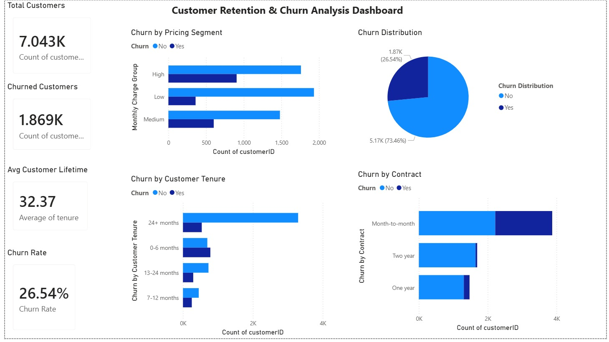

# FUTURE_DS_02
# Customer Retention & Churn Analysis

## Problem Statement
This project analyzes customer churn behavior to identify key factors influencing customer retention and business growth.

## Objectives
- Identify churn patterns and high-risk customer segments
- Analyze customer behavior based on tenure, contract type, and pricing
- Provide actionable recommendations to reduce churn

## Tools Used
- Power BI → Dashboard & visualization  
- Excel → Data cleaning & preprocessing  

## Key Insights
- Month-to-month contract customers have the highest churn (43%)
- New customers (0–6 months) show the highest churn (53%)
- Long-term customers (24+ months) have significantly lower churn (14%)
- Monthly pricing has minimal impact on churn (26–27% across segments)

## Business Recommendations
- Encourage long-term contracts through discounts or offers
- Improve onboarding experience for new customers
- Focus on early-stage retention strategies
- Strengthen customer engagement in the first 6 months

## Dashboard Preview

## Dashboard Features
- KPI cards (Total Customers, Churned Customers, Churn Rate, Avg Lifetime)
- Churn distribution visualization
- Churn by contract type, tenure, and pricing segment

## Files Included
- Power BI Dashboard (.pbix) 
- Dataset (.csv)
- Dashboard Report (.pdf)
